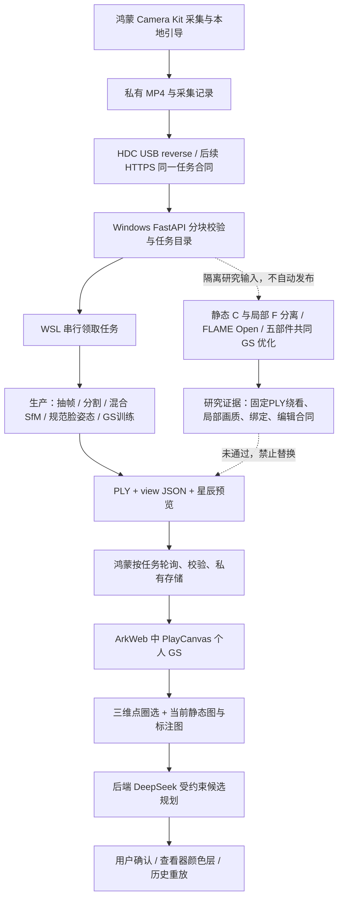

# SELF 当前完整技术路线与下一阶段分析交接

日期：2026-09-28。工程：`D:\STUDY\College\mine\olay`。

这是一份基于当前代码、依赖和实际实验记录的交接材料，不是新方案已实施的声明。本次只读审查代码并整理本文，没有改应用、算法、签名、作品或服务配置，没有训练或向平板传送模型。供外部 GPT 在缺少历史上下文时分析下一阶段优化。

## 1. 目标、边界与最重要的当前结论

SELF 的宗旨是：**提供新的观察可能，但不规定用户必须得出什么结论。** 用户在星辰主题的沉浸界面中采集自己、观察真实三维面容、表达感受，并自主选择保留或尝试数字变化。不能把用户的特点默认归类为缺陷，也不能把产品资料、通用染色或生成细节包装为真实测量结果。

重建目标按优先级为：

1. 本人面部清晰、立体、各可靠观察方向一致；真实细节来自原片。
2. 头发、五官、眼镜、耳侧结构可信；头、颈、肩、衣领和衣物连续自然。
3. 房间背景可辨且连续，与人物处在同一个空间。背景可降低细节，但不能删除背景、留下孤立人头或用屏幕贴片填洞。
4. 正面至左右约 60° 或更宽的已观测范围内，错误背景高斯不能遮住脸。不能删除真正遮挡，也不能靠透明人物、巨大皮肤壳或缩窄轨道制造通过。
5. 兼顾 8GB 笔记本 GPU、合理用户操作门槛、约 2—3 分钟的完整任务目标和鸿蒙端交互流畅性。精度与稳定性优先，不能用降低真实面部质量换速度。

**必须分开理解两条当前路线：**

| 路线 | 实际入口 | 当前状态 |
|---|---|---|
| 应用自动建模生产链 | `reconstruction_worker.py → reconstruction_train_joint.py --best-effort` | 保持原链路；还不是最新五部件算法。具备传输、自动训练、下载和显示代码，但有已知共同遮挡/相机/点序缺口。 |
| 最新离线研究链 | `run_integrated_shared_v2.py → reconstruction_components_v2.py / reconstruction_shared_v2.py` | 已跑真实五部件联合优化、原生 ROI 和覆盖检查；候选画质仍失败，不能发布或替换平板作品。 |

真实反向传播已经有效：早期 Open 局部头部 900 步在 14 个训练视角、8 个开发留出视角下，固定 ROI RGB L1 从 **0.06438 降到 0.04125**。这证明局部外观可优化，**不证明头发、镜框、完整人像或所有角度合格**。

最新 V2E 同时渲染房间、皮肤、头发、眼镜、颈肩衣物，真实跑了 1800 次 Adam 更新、835 次父点替换。污染和部分鼻唇误差改善，但仍有头发稀疏/团块、镜框不连续、皮肤细节柔化、颈肩连接和部分背景问题。没有向平板回传这些候选。

此外发现实际查看器默认重排 PLY 点，破坏现有 `editableSplats` 面部前缀合同。这是独立的集成问题，不能用渲染单测或“选中了若干点”证明真实面部编辑隔离。

## 2. 当前工程与环境冻结信息

根目录和 backend 未发现 `AGENTS.md`。仓库已有大量未提交有效修改，不能以 Git HEAD 代替当前工作目录。审查时 HEAD 为 `f68587bb34f8970d21bda9231e15b2536a33df97`；不要重置工作区或整仓重写。

| 项目 | 当前事实 |
|---|---|
| 鸿蒙应用 | ArkTS/ArkUI + C/C++ NAPI，包名 `com.self.mirror`，版本 `0.1.0`；已有调试签名与历史作品。 |
| SDK | 构建配置 target `26.0.0`，compatible `5.1.1(19)`，runtime `HarmonyOS`；既往使用商业 DevEco/SDK `26.0.0.821` 构建。兼容声明不等于 API19 全能力实测。 |
| 设备类型 | 配置 phone / tablet / 2in1，已有平板横竖屏设计。最新研究资产本轮未做鸿蒙实绘。 |
| 个人 GS 查看器 | **PlayCanvas 2.22.4**，本地 ArkWeb/WebGL2；不是当前依赖原生 Scene Kit 直接显示个人 GS。 |
| 其他网页依赖 | three `0.186.0` 仍在仓库，不能据此把个人 GS 路线写成 Three.js。esbuild `0.28.2`、playwright-core `1.63.0`、pngjs `7.0.0`。 |
| GPU 训练环境 | Windows + WSL Ubuntu-22.04；Python 3.10，`/opt/self-reconstruction/venv/bin/python`。 |
| 训练依赖 | PyTorch `2.8.0+cu128`、torchvision `0.23.0+cu128`、gsplat `1.5.3`、PyCOLMAP `4.2.0`、OpenCV `4.12.0.88`、MediaPipe `1.0.1`。 |
| 相机求解设备 | 当前 PyCOLMAP 环境是 CPU SfM；CUDA 用于 PyTorch/gsplat。 |
| CUDA | 12.8，`CUDA_HOME=/usr/local/cuda-12.8`，`TORCH_CUDA_ARCH_LIST=12.0`，`MAX_JOBS=2`。 |
| 显卡 | NVIDIA RTX 5070 Laptop GPU，约 8GB；研究训练期间实际使用远低于 8GB。 |
| 服务 | Windows FastAPI/uvicorn，本地 127.0.0.1:8787；WSL worker 通过共享文件目录领取任务。 |

当前文件 SHA-256，区分“当前源码”与“当时实验源码”：

```text
backend/reconstruction_worker.py
7173bae2b9e5637995e9503000c3c6319c857fa1700bc9f635174253fca3cb15
backend/reconstruction_train_joint.py
4af2934fd6199ae42cdf8ca14e2abdced2af9de2cd635b7cd644dd23cd7f8c6c
backend/reconstruction_components_v2.py
832cd8363bc130bed69d07a641ed83170a68ef0bbca2ee85ff2687a6f9163161
backend/reconstruction_shared_v2.py
0a39ea562c3c92edff2c56ef8a6fe43d3ce5a1d09c2980cad84cc8ba830b14c7
viewer-gs/main.js
70c1f8fbe0ce1cbbc76370003a886cb42e2ee443b7a62370c670aedf208dff4e
package-lock.json
39f45bee06bae03d273461783742507419d05dd1551ddb034a354ddaa9c0a5ba
```

V2E 训练当时的主算法 SHA 为 `20bd5c6abea043e634ac70dde8fb9dd926d68dd1ef9386d4b502f894aae10a90`，已连同依赖快照保存在该 run 的 `algorithm-snapshot/`；之后当前主文件增加了补充审计。不能仅凭当前文件哈希复述过去训练。

**环境阻塞：**完成 V2E 后，末次系统检查显示 RTX5070 为 Unknown、IsPresent=false，WSL CUDA 不可用。已确认没有活动任务后刷新同入口闲置 worker，清除旧的 ready=true 缓存。此次读取 `worker_status.json` 为 ready=false，原因 `RTX 5070 CUDA unavailable`。尚未查明独显离线原因，也没有证据归因为显存不足。本文没有修驱动或重启系统。

## 3. 系统数据流



本地 ArkWeb 不等于访问外部网页：查看器代码随应用打包，`https://self.local/portrait.gaussian.ply` 和 view JSON 被原生请求拦截，以应用私有字节返回。重建在本地 GPU，DeepSeek 的云端规划经后端发出。普通观察、已保存模型和本地撤销不依赖云端规划。

没有使用 Blender `.blend` 作交付格式；没有把 FLAME mesh、黑底头部研究样件或原生 SDK 预留接口当作最终完整作品。REMY 的公开演示用于采集/交互参考，当前代码并不是其私有重建器，不能宣称复用了 REMY 内部算法或服务器方案。

## 4. 鸿蒙采集、人脸跟踪、方向与引导

主要文件：

- `entry/src/main/ets/pages/CameraCaptureView.ets`
- `services/CameraCaptureSession.ets`、`LocalFaceGuide.ets`
- `services/FaceAnchorTracker.ets`、`CameraPreviewTransform.ets`
- `services/CaptureMotionGuide.ets`、`ViewCoverageGuide.ets`、`FaceParticleField.ets`
- `entry/src/main/cpp/CameraPipeline.cpp` 及 vendor/libfacedetection。

### 4.1 原始录像和分析流分开

Camera Kit 查询真实相机、预览/视频规格及编码器能力，优先前置。选择可组合的预览与视频 profile，最高约 1920×1080、30fps，AVRecorder MP4，目标码率约 8Mbps，无录音。必须以设备实际 profile/编码范围为准；电脑相机分辨率不需要人工设成完全一致才能调用。

预览到 XComponent；另建 ImageReceiver 分析支路，一次只处理一帧。分析 PixelMap 最大边 960；C++ libfacedetection 和 Core Vision 使用本地相机帧，不是 DeepSeek 人脸识别。

原生 AVRecorder 录像不经过跟踪分辨率缩小。`LocalFaceGuide` 还保留软件 H264 记录接口，但不能把它与当前主要 AVRecorder 1080p 路径混为一谈。

### 4.2 方向合同

- 显示旋转和镜头参数交给 Camera Kit 的 `getPreviewRotation` / `getVideoRotation`。
- SDK 旋转预览一次；分析 producer 维持原始方向，PixelMap 软件旋转一次，避免重复旋转。
- 明确区分 RGBA format 3 / NV21 format 1003，处理 rowStride，显式填写 srcPixelFormat；不按字节数猜格式。
- 仅针对 API26 emulator RGBA 的底部起始缓冲做垂直翻转，不套用到真机 NV21。
- 识别坐标映射到显示时再应用前置镜像和 center-crop/fill 的实际缩放偏移。
- 录像使用实际 video rotation 元数据；服务端解码必须与它一致。
- 录制时改变设备方向会提示保持当前方向，现有录像不会随每次屏幕旋转任意改流尺寸。

### 4.3 跟踪算法及边界

原生 libfacedetection 输出框与 5 点；Core Vision Kit 在可用时给独立确认及 yaw/roll。分析检测约每 100ms，官方姿态约每 350ms；只允许一个在途 CPU 工作。

`FaceAnchorTracker` 使用置信度≥0.80、完整框、5点几何合理性、单脸关联、速度自适应低通和幅度限制；连续约3个真实样本锁定。用眼/嘴共同移动判断鼻点跳动，避免只因鼻尖拟合抖动就大幅移动锚点。短时丢失最多约650ms保持旧锚点，但标记 observed=false；保持状态不得用于证明新视角已采到。官方确认缓存最长约1400ms，连续失配会清除，不能悄悄在锁定中切换不同检测器的鼻点坐标。

移动引导使用相对平移/yaw，拒绝单次跳变、纯缩放或轻微抖动，不按计时假装捕获完成。角度条有13格：-60°至+60°、每10°，指针连续平滑；点亮必须由新鲜官方 pose、置信度、取景完整性及短暂稳定支持。它描述相对脸姿，不是世界相机位姿，也不是重建质量通过。

圆圈/粒子只是 UI。`FaceParticleField` 从规范曲面生成有深度感的点，再随 yaw 投影；5个检测点不能恢复用户真实三维表面。**不能把粒子贴合动画称为已测量本人网格。**

当前拍摄键手动开始/停止；没有原来的30秒自动结束。停止后退出拍摄页、命名星辰并进入等待动效。角度格是提示，不强制用户严格打满。后台/页面离开释放相机和分析资源。

### 4.4 当前没有采集到的关键量

现有 MP4 sidecar 明确 `poseData:false`。没有稳定采集并传输逐帧独立标定 K、畸变、AR世界相机位姿和物理尺度。上传 manifest 主要是字节数、哈希、mp4格式；跟踪圈位置/角度格不是重建位姿输入。识别平滑也不是原视频防抖或真实世界几何矫正。

## 5. USB、任务、文件存储与清理

### 5.1 当前通道

`Connect-ReconstructionDevice.ps1` 使用 **HDC rport** 将设备 localhost:8787 反向连接电脑 localhost:8787。`Watch-ReconstructionDevice.ps1` 每约5秒检查在线设备和映射，断线后恢复，必要时隐式启动本地服务；多个设备需要明确 serial。不是 USB 任意文件复制或云端公网上传。

`ReconstructionTransportClient` 的端点合同允许既定本地 `http://127.0.0.1:8787` 或未来 HTTPS。`SELF_BACKEND_TOKEN` 是 SELF 后端访问口令，**不是 DeepSeek API key**。DeepSeek 密钥仅在后端，不打进 HAP。

未来改服务器可保留客户端任务接口和资产合同，替换 transport/endpoint；目前没有实现生产公网部署、队列集群、对象存储、租户隔离和断线续传的完整服务治理。

### 5.2 任务协议

前缀 `/v1/reconstruction`；protocol=1、chunk=1MiB，视频上限1GiB。

1. health 区分传输 ready 与 worker engine ready；心跳超约30秒不视为可重建。
2. echo 做真实双向字节检验，只是通道证据，不是重建证据。
3. POST jobs 创建32位十六进制 job ID，记录视频大小和SHA-256。
4. 逐块上传，校验块哈希；seal 检查全部块、大小、全文件哈希，再原子形成 capture.mp4 和 queued 状态。
5. worker 状态为 queued/running/gaussian_ready 或 failed；UI约5秒轮询，不将进度百分比当质量通过。
6. 完成资产清单提供 file/bytes/sha256；PLY分块下载，全文件校验后 fsync 和临时文件rename，view JSON另校验结构。
7. cancel 请求与进程退出分开；在途任务先结束worker/子进程再删除输入，不删除被活进程占用的文件。

状态机/任务文件通过原子写和服务端每任务锁维护。上传块可以识别重复；应用现有客户端不是完整断网自动恢复任意中断块位置的实现。

### 5.3 固定位置

| 用途 | 位置 |
|---|---|
| 鸿蒙原片 | 应用 `filesDir/captures/capture-<timestamp>.mp4` 及 `.json`，留在采集记录，用户可删除/重提交。 |
| 鸿蒙模型 | `filesDir/models/<jobId>/portrait.gaussian.ply`、`portrait.view.json`、各预览。 |
| 当前作品指针 | `filesDir/reconstruction-result.json`。 |
| 编辑与历史 | 同模型私有目录的 `portrait.edit.v2.json`，旧 `.edit.json/.mask` 保留读取。 |
| 星辰/原话 | 由 `PortraitStarStore`、`StoryObservationStore` 在应用私有存储按作品关联。 |
| 电脑生产任务 | 启动脚本指定 `backend/.data/reconstruction/<jobId>/`，Windows/WSL共用同一目录；服务默认目录另可为 `%LOCALAPPDATA%/SELF/Reconstruction`，以实际启动配置为准。 |
| 私有离线实验 | `backend/.sources/<独立run-id>/`；不进入生产 jobs，不自动发布。 |
| 模型/权重 | 项目 `backend/models/` 或 `.sources/third_party/`，不依赖下载文件夹作为长期路径。 |

**清理时机的精确事实：**生产 worker 成功生成并登记资产前会清理电脑原视频、解码帧、数据库与训练临时文件，保留结果、job记录、帧来源和来源侧车；失败任务也清理输入。它不是“确认平板已收妥后才删源片”的两阶段ACK流程。平板原片不会被此清理删除。研究输入为了对比留在 `.sources`，不等于所有电脑副本即时删除；研究副本生命周期需要另行管理。

## 6. 自动生产重建链：实际算法与已知不足

### 6.1 解码与选帧

`reconstruction_worker.extract_frames` 验证流、大小、哈希和时长，接受约8—600秒；按时间分桶选较清晰帧，数量 `min(160,max(72,ceil(duration×3)))`，源PNG不空间降采样。评分图临时缩到480×270，以中心区域Laplace方差为主（约0.8中心+0.2全局）。低成本中心清晰度不等于真实面部逐点清晰度或视差充分。

记录源帧零起始索引、PNG哈希；ffprobe PTS仅在与解码数量一致且递增时关联，否则明确缺失/估计状态，不伪装精确时间。

### 6.2 分割、相机与运动

实际 run_one 调用 `reconstruction_face.prepare` 的 MediaPipe分割/关键点；worker 文件中还留有旧 Haar helper，不能误写为当前主检测器。生成脸/头部mask、全人物排除mask、468点与观测文件。

当前生产 `recover_cameras` 在被 prepare 接受的帧上，对人物和房间混合图像做单相机 SIFT；CPU sequential matching，overlap=18、quadratic_overlap=true，再 incremental SfM。以注册数/点数/脸与房间轨迹量作基本有效性检查。这仍受人物运动与弱静态结构干扰，不是研究版的严格静态世界相机门禁。

`prepare_face_views` 使用 MediaPipe 468点规范脸 + solvePnPRansac/RefineLM，PnP当时用零畸变，估计统一人物—房间尺度，选择参考头状态，构造面部补偿训练相机。该规范脸不是本人细致形状，没有自动使用 FLAME Open 个体拟合。

背景 `seed_recorded_scene` 从SfM稀疏观测插值深度：24px采样网格、4邻居、最邻距离允许到360px，上限约20000环境种子。它不是稠密测得真实表面；宽域插值可能在弱支撑处制造错误背景几何。V2研究已改成更严格的三角内多视图支持，但生产未切换。

### 6.3 训练

`reconstruction_train_joint.py` 默认至少3000步。初值包含SfM点与背景种子，按面部mask多视图票数分人物/环境。可优化 means、log_scale、quat、alpha-logit、SH0/SHN；点来源与semantic为冻结标记并随拓扑变更保留。SH阶数约每900步提高，最终到3阶。

面部在原像素crop训练，房间在半分辨率训练；有轮换schedule避免永久饿死某些视角。DefaultStrategy进行分裂/克隆/裁剪，500000点或Torch峰值7.4GiB为容量保护。

**关键已知缺陷：默认分支仍交替隐藏另一组opacity来训练面部/房间。**最终把两组导出一份PLY不等于训练时共同排序与遮挡已经正确。`--shared-research` 分支让所有组共同前向，是隔离研究开关，worker未启用；不能称生产已完成真实共同遮挡。

### 6.4 “尽量给模型”与严格研究门禁不能混淆

生产以 `--best-effort` 保留有结构的捕获结果；头PSNR<24、房间PSNR<20、room alpha<0.95、面部点<8000、房间点<5000是画质提示，不因这些指标单独丢弃模型。但无效/空几何、识别/相机失败、文件破损、GPU不可用仍可能失败；没有合法依据保证任意输入都可生成本人真实3D，不能用假头或生成面容代替。

这项交付策略不降低 E1—E5 新算法发布标准。最新失败研究候选仍禁止覆盖旧作品。单独PSNR、注册160/160或多点数都不能作为质量放行。

## 7. 研究输入、关联与 E1 世界相机

固定输入为现有历史原片，不要求重拍：

```text
逻辑视频：capture-1790410633104.mp4
电脑路径：backend/.sources/quality-geometry-20260926-temp/capture.mp4
bytes：65,453,964
SHA-256：7ac189eb49e05c83220addf16c1fabe325ef35e32d8ffd7e4c5af4824777e4cf
duration：65.393秒；源帧1963；原基准选帧160
编码1920×1080，rotation=270°，解码正向1080×1920
```

`frame_manifest.audit.json` 逐帧核对图像名、源帧索引、PTS、方向、图像/mask哈希、K、camera ID及实际W2C。**以相对文件名关联，COLMAP IMAGE_ID不是视频帧序号。**缺失位姿保留缺失，不用顺序zip、单位矩阵或上一帧填充。

静态 E1 对照保持同160帧、全人物排除mask、基础特征/匹配与估计内参条件；数据库使用副本。106/160逐步候选与160/160全局候选按静态内点分布、长轨迹、重投影分位数、三角化角、扰动稳定性比较，不能按数量选优。

原片有本人两侧观察，诊断相对脸角约-64.5°到+56.95°；缺的是关键中段可信世界连接，不是用户没有拍到另一侧。mask不能缩窄以引入运动人物特征“救”房间位姿。

当前静态研究地图 `static_sfm_probe_stride1/targeted_global/sparse/0`：3532静态点、160注册；扰动/分布检查仅104暂可信研究视角，关键61—100区间为0，**最终可信世界相机尚未放行**。K是估计而非独立标定：SIMPLE_RADIAL，f约1189.07588px，cx540，cy960，k1约0.01772216。

已经做过有限救援：1963源帧中低成本检查163候选、少量桥接帧；ALIKED N16 + LightGlue定向匹配，独立新特征空间；固定可信锚相机形成局部2D—3D地图，仅定位query、不让query拉动锚。部分匹配增加但空间分布/留出定位仍失败。没有新静态地图、独立K或可核几何时，不重复无界同段SIFT/ALIKED实验。

ALIKED/LightGlue commit `eb42fee2d71449efb0aa5c10549752b5d75384d8`；记录中ALIKED为BSD-3、LightGlue代码/权重为Apache-2.0，具体权重哈希保留在原E1记录。这些是已做的E1研究对照，不是当前生产特征抽取器。

## 8. 局部本人几何、FLAME 与坐标合同

### 8.1 模型与对照结论

Open 模型实际文件：`.sources/third_party/flame2023_open/flame2023_Open.pkl`，SHA `e75a0990728ba038c7da2a420ae4396f7ddd7781366c13026066c5b24f127623`；5023顶点、9976三角、5关节。共享24维身份形状、受限12维表情用于当前实验。105点嵌入、模型数据和实现代码分别核验，不使用平均脸纹理或生成皮肤。

Open官方模型标示CC-BY-4.0；普通版SHA `8fb1af0db1abb51053ead8fd1f2624a63d01c9602f4a4fb4ea23bd2c82017fa0`，只作离线研究，未建立长期产品许可。独立 `flame_open_model.py` 实现前向蒙皮，未因示例MIT标签而偷偷引入不同许可smplx。未用非商业texture-space作为产品纹理。

同视频、14/8划分、crop/K、来源取色规则、footprint=1、900步、开放顺序和损失的A/B已完成：

| 开发帧 | Open 初始→900 | 普通版 初始→900 |
|---:|---:|---:|
| 15 | .06905→.03530 | .06597→.03474 |
| 35 | .06055→.03327 | .05886→.03342 |
| 55 | .06238→.05714 | .06055→.05707 |
| 75 | .06745→.04233 | .06450→.04347 |
| 95 | .05646→.03615 | .05339→.03664 |
| 115 | .07215→.04809 | .06966→.04653 |
| 130 | .05789→.03883 | .05767→.03864 |
| 145 | .06914→.03893 | .06988→.04321 |
| 均值 | .06438→.04125 | .06256→.04172 |

两者均有发壳、眼镜漂浮和软边，没有证明普通版有足以切主线的稳定局部优势。继续Open研究，不重复版本选择。14训练帧为5/12/25/40/50/60/70/80/90/100/110/120/136/150；8开发帧为15/35/55/75/95/115/130/145。数字是所选图名序号，不是COLMAP ID。8帧已参与方案选择，不是最终盲测。

该表是当时已完成的A/B协议，不把其均值贴到随后修正的head-local-sh1或V2上；不同颜色语义、mask/ROI、K和运动协议必须分别报告。

早期关键点5.17→3.66px只说明该留出关键点协议改善，不能作为本人三维细节或发型精度证明。

### 8.2 faceObservation 和 worldObservation 分离

- `F_t`：头局部到相机的刚体变换；局部形状/表情、K、可见范围、图像变换与可信度随 faceObservation 保存。
- `C_t`：世界到相机的W2C矩阵，只由实际静态世界证据支持。
- 只有统一尺度和坐标约定后才能使用 `H_t = inverse(C_t) × F_t`。实际研究F的平移先乘唯一共享尺度s，头局部点也按s进入房间单位。
- 世界相机缺失的帧可参与可信局部头部几何/外观研究，不能构造世界H或把房间加入联合训练。
- 若资产已冻结在参考世界状态，运动相对变换为 `H_t × inverse(H_ref)`；参考时刻相对变换恒等，不要求绝对H_ref为单位矩阵。

根关节处理用中性根mesh与显式根姿态合同，避免FLAME内部旋转和外参重复施加。非零shape、颈/下颌状态需要继续保持回归。FLAME是几何/运动先验，头皮不是真实发型，颈模不是衣领真值。

## 9. 颜色语义、训练—PLY—查看器对齐

已修正并保留的研究基线为 **head-local-sh1 + 精确SH导出**。旧Open900结果保留回归，但不退回已知错误方向语义。

当前研究优化标准SH0+SH1系数，不是“后激活RGB加自定义方向项”。点位置、局部quat、方向色都在头局部一致表达；随头变换时同时旋转SH1到世界。实际gsplat evaluator与导出系数转换已做数学和图像回归。

标准PLY包含位置、log尺度、wxyz四元数、opacity logit、DC与高阶SH字段。研究只有1阶颜色，导出按现有查看器字段补齐2/3阶零系数；不能把这些SH系数解释为真实皮肤albedo、roughness或产品BRDF。

每个候选只冻结一个参考时刻、导出一份PLY，然后连续改变相机；不按viewer角度换模型。最新参考为 `frame_0111.png`，PTS45.324422s。B/D训练图→PLY→gsplat同相机AA均值误差约4.38e-8/3.48e-8，支持颜色导出一致；PlayCanvas与gsplat不保证逐像素相同。

旧微诊断显示同几何、同alpha的完整SH侧面亮区有2637极亮像素，仅DC为0，但DC仍有大块发壳/错位。因此方向色外推能放大亮边，不能替代结构原因。两渲染器都出现错误，**没有排除共有中心深度排序和投影近似**。不能据一行公式认定所有颜色坐标错误，修正基线应保留。

## 10. 最新五部件研究：数据准备与初始化

### 10.1 保守观察mask

`make_component_observations` 从实际MediaPipe多类分割、hair概率、468点和RGB生成：

`face_core / face_boundary / hair_visible / glasses_visible / neck_cloth_visible / room_visible / unknown_or_occluded`。

典型阈值：core按约脸宽2.5%腐蚀，肤/其他置信≥.70并排除发/镜边；hair概率≥.65且分割置信≥.55；glasses是眼区高对比Canny55/125与候选类别交集，不把所有“other”当眼镜；room背景概率≥.85且排除整人物扩张区；未分配和整流越界进入unknown。可见mask不是完整3D真值，缺失hair标签不能雕掉被遮挡/未知发量。

RGB、mask、关键点以同K/k1在原分辨率去畸变，RGB线性采样、mask最近邻；crop只平移主点，不靠mask外涂黑做邻域损失。

### 10.2 相机连接与子集

复用现有Open拟合，固定shape/表达先验，以当前真实K/畸变做有限局部PnPRefineLM，每第五点留作几何检查。旧22帧微调限约3°/35mm；有限邻帧以实际求解而非拷贝pose纳入，限约12°/60mm且拟合中位≤6px，最近已有表情只作明确记录的先验。

当前world/local交集是59训练+5开发，原开发55/75/95没有世界连接，不进入房间联合；不能据此声称那一侧原片不存在。共享s=13.35442，单一静止中心规范连接的残差P50约.01307m、P90 .02306m；这是先验尺度连接，不是独立物理测量。没有每帧scale/任意自由平移或平滑虚构视差。

原生源图尺寸大不等于脸部有同样多像素：早期35/75/145开发视角的实测脸宽约280/300/299px，必须按真实脸宽对齐比较细节。此前14训练局部F的覆盖也不对称：固定参考资产viewer +60°时鼻/头发离最近有效训练方向约46.66°/60.61°，-60°约8.50°/18.80°。这些是局部支持诊断，不是精确测量角；原视频两侧存在与当前已可靠拟合/可取色的两侧都充分是不同问题。必须把已观测重建错误与缺少可靠局部支持的外推错误分开。

### 10.3 部件初值及不足

| 部件 | 初值 | 实际表示 |
|---|---:|---|
| 房间 | 22020 | 2000实测静态点+20020有多视图支持的局部三角内样本；来源保留。 |
| 皮肤/主面部 | 5486 | 从已有真实取色且优化的Open表面点中保守筛选，稳定三角/重心绑定。 |
| 头发 | 267 | 独立头局部真实三视图三角种子，不贴头皮。没有完整发型体积。 |
| 眼镜 | 16 | 独立空间种子，不默认贴FLAME；镜圈/镜腿/鼻托网络尚未建立。 |
| 颈肩衣物 | 1762 | 1414绑定点+348独立衣物种子，运动/连接仍简化。 |
| 总计 | 29551 | 所有组共同参加每次前向。 |

房间改用实际静态轨迹error<2.5px、track≥3、多训练视角room支持；Delaunay只在可支持三角内插入，边长约≤80px、深度差≤6%、法线一致。至少3视图支持，有限颜色一致性与矛盾检查；没有360px外推或低置信补雾点。表面样本使用薄各向异性及真实三角/PCA法线，仍不是房间密集真值。

皮肤来自原基线8798表面点；支持必须在正确相机坐标下判前向法线，至少3肤区票、0发票、少于3镜框票。保留鼻/唇/面颊可靠表面，不把背景肤色填入无来源点。新增修正约3.5mm法向、约0.35倍法向限的切向，不能无限漂浮。

头发/镜框从新RootSIFT特征空间做互相匹配ratio .8、限定局部邻视图、≥3独立视图循环DLT、正深度、≤2.2px重投影、≥2°射线夹角，结合可见mask。头发离FLAME先验约2—85mm、镜框约1—45mm为有限搜索范围，不是厚度真值。取训练源像素颜色，不读取开发颜色。原2917粗发壳点排除，不能宣称真实头发完整保留。

二维LSD眼区线段829条目前只生成/计数，没有跨视图3D线网络。因此“提取了镜框边缘”不能写成“镜腿/鼻托已恢复”。衣物旧地图对齐0种子通过，没有偷偷补入；另以新研究相机三角化得到348点。

头发/皮肤/镜框随头运动，绑定颈部随mesh；独立衣物在头下采用最多.65的有限平移混合，不跟头刚性旋转。这是显式简化，**肩部姿态、衣领遮挡及连续连接未通过**。

## 11. 五部件共同优化、损失和拓扑

### 11.1 参数和共同遮挡

优化means、log_scale、quat、opacity logit、标准SH1。同时维护冻结base_xyz、part、tri_id、bary、normal_offset、support、source_index、family_id、generation、initial_scales。

位置有界：绑定皮肤约3.5mm、hair4mm、glasses2mm，房间/衣物约.02×s；初始已拟合表面offset另保留。头局部高斯进入世界时同步变换位置、尺度、quat和SH，房间静态。

每次半分辨率全图和原生ROI都含五组，使用同一次光栅化输出RGB、总alpha、五组贡献q和贡献加权深度。检查sum(q)=alpha、部件深度贡献守恒、所有组关键反向梯度。冻结某组参数不隐藏它；不是分别渲染再叠贴图。

q只说明透明合成来源贡献，不能自动证明几何可靠或把低q当“清除污染成功”。

### 11.2 原片损失和局部容量

全图约540×960；原生ROI为face/hair/nose/lips/eyes_glasses，不缩源脸细节。选择由语义、真实残差和使用老化驱动，不是手工固定某一视频帧特殊处理。

主要损失：

```text
每个前向：
  weighted_RGB_L1
  + 0.18 × 脸核心中错误前景贡献的先验深度门控
  + 0.025 × 面部覆盖不足
  + 0.012 × 房间覆盖不足

每步总损失：
  全图loss + 1.8×原生ROI loss
  + 0.0003×有界几何正则
  + 0.0003×SH方向正则
  + 0.01×超过初始尺度2倍的支撑尺度惩罚
```

图像权重约room1、unknown.15，face_core额外+2、hair+1.5、glasses+3。脸前深度门控基于FLAME先验射线深度，前方约12mm、差值截至40mm；边界/unknown不硬删。该深度不是测量真值，不能只加污染权重就遮住场景错误。面部覆盖目标约q_skin+q_glasses≥.96，房间检查真实alpha和RGB。

Adam学习率：means .00012、scales .0015、quats .0004、opacity .008、SH .002；前100步冻结means/quat，随后有界优化。没有同时任意放开世界相机、K、每帧shape或无界运动。

### 11.3 覆盖保持的父点替换

基于gsplat **1.5.3安装源码**的DefaultStrategy/optimizer重排操作，两次前向和strategy都启用absgrad。220步之后、每120步、结束前200步停止；不以周期opacity reset制造变化。

优先满足实际原生footprint大、源残差>.018、支持≥3、投影计数≥3、梯度条件的部件点。原生半径预算：room42、skin9、hair14、glasses5、cloth32px；单次配额约room12、skin48、hair12、glasses4、cloth12。

V2E沿**真实协方差最大轴**分裂：该轴scale×.8、两子中心±.6父scale，其他轴不全缩。父点删除，插入两个子点；按投影质量近似分配optical density。它不是精确透明合成等价，必须实际核验覆盖。

绑定皮肤重新求附近三角/重心，不只复制tri_id；每个子点重新检查至少3训练视图真实mask支持。保留旧点Adam动量，新子点状态清零；parameters、optimizer、strategy缓冲、part、绑定、置信、源点和family同步重排。

参考/首/末3训练视角共同前向检查：新增空洞>.005或room alpha下降>.005则回滚参数、Adam和全部状态。开发图不决定拓扑。D的12次提议全部真实撤回；E实际接受835父点→1670子点，clone=0、prune=0。不能称执行了实际裁剪后又只给提议计数。

## 12. 为什么目前仍不细致、头发为什么像壳

这是按当前证据排序的分析，不把所有原因当已证实：

1. **几何起点/多视图支撑不足是明确结构缺口。**早期发型是二维hair mask占据形成粗壳，不是稠密深度。共同优化主要改变颜色、alpha和scale，位置移动约0.8mm，没有把发际线、鬓角和耳上厚度校准到真实体积。最新独立267种子有三视图支持，但远不足以覆盖真实发型，不能靠少量真实点宣称完整替代帽壳。
2. **镜框容量与结构缺失。**旧细节点靠FLAME，亮颜色代替正确深度；最新16→24独立点仍不能形成连续镜架。镜框反光也使普通点匹配困难。二维829线段还未转为3D稳定连接。
3. **实际屏幕足迹太宽。**E正面原生皮肤半径P50=28px、hair54px、glass29px；房间/衣物有数百px尾部。它是投影支持半径，不应机械等同光学模糊半径，但与源梯度衰减和软边相符。直接全局缩点曾显著增加缺失和误差，不能独立作为解决方案。
4. **姿态/形状残差仍可能多视图平均细节。**共享先验并非本人测量mesh，部分局部姿态受模板和弱观测约束；bounded refine还没有完全解决镜框、鼻翼、唇边错位。不应任意松动姿态掩盖结构。
5. **方向色外推与宽高斯/排序共同影响侧面。**修正了SH坐标并不等于外推方向有足够训练观测。完整SH与DC对照证实亮边部分由方向色放大，但共有中心排序近似尚未完全排除。
6. **边界与全场景连接仍未成熟。**静态world弱连接、简化衣物运动、稀疏发/镜与有限表面背景可能在侧转暴露间隙/错误遮挡。不能通过删除背景或羽化后处理替代连续联合几何。

以上不是“8GB用满导致糊”的证据。必须用单因素或明确整体流水线对照、局部图像和相同冻结资产连续视差来验证每项归因。

## 13. 资产、PlayCanvas、圈选与 AI 编辑合同

### 13.1 交付格式

当前实际生成：标准GS二进制little-endian `portrait.gaussian.ply` + `portrait.view.json`；有png缩略、低点数portrait预览及完整场景LOD用于星辰宇宙。LOD只为历史漫游性能，不能算主模型精度提升。

view schema=1，含source frame、camera/target/up、fov、面部点数前缀、环境点数及视角元数据。研究侧车 `portrait.components.npz` / 生产 `portrait.provenance.npz` 保存资产hash、稳定绑定/源点/部件/置信；**这些新研究字段尚未作为生产传输资产或当前编辑语义接入**。

FLAMEmesh只是内部先验；当前并没有通过最终纹理Mesh/GLB完整本人验收。端点中mesh类型、`ReconstructionClient`原生SDK adapter等保留接口不能冒充已完成自动mesh或端侧3DGS重建。

### 13.2 显示与性能

ArkWeb原生拦截本地PLY/view字节，PlayCanvas创建gsplat。WebGL2必须实际可用。GS模型/背景是一份共同资产，查看时同场景相机旋转，不把背景独立移动。

支持旋转、俯仰和缩放；俯仰至少允许约±30°作为观察操作，不宣称未拍到的表面真实恢复。yaw可能受view安全范围约束；控制yaw不能直接当本人真实观测角。横竖屏据窗口尺寸调整fov/构图。移动中降低像素预算，静止恢复；大约220万像素目标、pixel ratio下限.55，避免高分平板透明高斯过绘。是否流畅需要真机实测，不把browser视频编码24fps写成设备fps。

当前原生拦截允许整份PLY最大256MB并读入ArrayBuffer，显示内存压力除点数外还涉及CPU副本、解析、纹理、透明overdraw；论文训练峰值不能证明平板不卡。

### 13.3 现有圈选实际算法

`viewer-gs/gs-edit.js` 在当前相机投影高斯中心，限制目标附近、alpha≥.12、editable范围；18px屏幕格内以18%深度分位估前层，排除比前层远约distance×.075的点，多边形边界羽化。至少28点，最多约60%editable点。选中权重绑定Gaussian，转动后重投影跟随；这是近似可见点选择，不是精确mesh表面笔刷或跨角度语义真值。

当前最多4个手工区域、各自ID/byte mask。未发送的新圈可替换上一圈，明确追加才多圈；不强制圈完切移动。关闭会话清除未完成选区，保留圈选工具模式与细微粒子消散；这些交互应冻结。

### 13.4 发现的真实点序漏洞

PlayCanvas 2.22.4 PLY parser默认 `asset.data.reorder ?? true`，做Morton排序。现有产品loader未设置preserve order，编辑却以“前editableSplats点”为面部，mask也是加载顺序。

E原6033皮肤点，加载后前6033里实际皮肤0；原Shared也有13970人物点移出前缀。旧报告selectedEnvironmentCount=0只按错误前缀计数，不能当真实人物/房间隔离证据。

隔离诊断仅使用 `reorder:false`，E全部30386点逐索引XYZ保持一致，皮肤6033留在前缀；真圈188皮肤、0非皮肤、试色有变化，原样/重放像素hash正确。**产品loader本身尚未改；诊断通过不是鸿蒙端或DeepSeek完整通过。**

后续应在现有引擎内明确保持索引或建立稳定source-ID映射；必须考虑已保存mask/旧作品，不可静默重排后重解释旧mask。索引合同属于功能集成修正，不能解决发型/皮肤画质。

### 13.5 DeepSeek做什么、没有做什么

规划路径：干净当前静态视角图 + 编号圈选图 + 用户原话 + 快照/资产/区域/图层版本 → Windows后端 → DeepSeek真实工具调用 → 候选 → 客户端校验 → 用户确认 → 查看器应用 → GS_APPLIED后保存历史。

模型默认配置名 `deepseek-flash`，可由后端DEEPSEEK_MODEL覆盖；base默认 `https://api.deepseek.com`。这是代码配置，不在本次重新宣称官方最新能力。工具只允许已登记区域/预设/图层，最多4操作：`set_digital_tint / set_effect_level / remove_effect`。澄清与编辑不能同回合混杂；迟到、错版本、未知能力和未授权操作拒绝。

**真正改变的是选中高斯DC颜色系数。**柔玫瑰/暖陶棕与强度.18/.32/.5是现有通用数字预览；混合量mask×min(.74,1.5×strength)。保留高阶SH、位置、alpha和原PLY，不重新训练geometry，不生成新Mesh或产品物理材质。历史从不可变原DC按顺序重放，删除组/单项无累计残留；原样比较、撤销和取消本地执行。

历史记录包含group/layer、遮罩checksum/base64、preset/strength及护理建议。原GS不可变；对geometry升级后能否沿用旧mask必须按资产版本判定，不能据点数相同直接兼容。现有个人GS确认与GS_APPLIED保存，不应冒充已完整接入旧原生编辑器所有授权/渲染质量/计费模块。

统一云端选择由 `CloudConsentStore` 保存：首次允许后默认发送，不每条弹许可；关闭会停止在途请求。用户确认候选编辑与允许发送仍是不同动作。后端有请求体限制、短期idempotency缓存、并发/频率限制及断开取消，但不是生产多租户账单系统。

## 14. OLAY、会话故事与必须保留的真实性

产品数据在 `shared/products/`：旧中国区目录、ID兼容、图片来源清单，以及audit-v2研究资料。audit-v2有74条研究记录：17品牌观察、46目录线索、10历史、1品牌搜索线索；不是74个当前在售独立配方，也不是全量在售保证。

**实物calibration profile=0、批准效果发布清单=0、已核完整大陆INCI/浓度参数=0。**图片或成分宣传不能直接换算成3DGS材质。护理资料/使用方法经careGuide关联到会话和变化历史；一般用法与来源解释不等于“这件OLAY产生了当前数字颜色”。

现有时间拖拽是独立、可撤销的可能变化情景，不能称某产品实际未来疗效预测。品牌效果请求在无标定时仍受解释门禁；不能为了“每次都有上脸效果”绕过合同用通用染色冒充品牌真实功效。下一阶段重建优化也不能擅自改这个边界。

会话在 `PersonalPortraitEditor` 与 `story_conversation.py`：底部常驻输入，圈选时临时让位；最多近期4轮文字上下文，不用动画轮次推动用户结论。意图引导到观察/行动/发现/照顾/回到自己；以真实输入和明确动作推进，不按时间自动完成五阶段。原话按用户“留下这一刻”动作与starId/assetId关联，优先附真实渲染视角，无法取得时只存原话；recallAllowed默认false。

原点夜空由粒子场景构成，不使用用户人像；个人历史以场景低点数星系漫游。背景、故事、导航、音乐、键盘避让、UI按钮和上脸参数本轮均应冻结，不把算法质量补救变成宣传文案或重做主题。

## 15. 最近真实实验、画质和资源证据

实验根：`backend/.sources/integrated-components-v2-20260928-{a,b,c,d,e}`，均独立run-id，不在生产jobs。

| run | 真实结果 | 进程内训练/末次审计秒 | Torch allocated/reserved峰MiB | 设备used采样峰MiB |
|---|---|---:|---:|---:|
| A | 支持/法线坐标问题后停止，无资产 | 未完成 | 不作验收 | 不作验收 |
| B | 1800Adam，29551→35387点，视觉失败 | 127.40 | 976.5/1158 | 1555 |
| C | 第241步GPU索引dtype失败，无资产；已修复回归 | 失败 | 不作验收 | 1483 |
| D | 1800Adam，12次拓扑提议全部回滚，29551点 | 144.28 | 976.8/1146 | 1543 |
| E | 1800Adam，835父点替换，30386点，视觉仍失败 | 179.65 | 977.7/1176 | 1573 |

E外层wrapper约200.61s；160帧第一次分割另125.55s，B准备122.01s，E复用缓存；不含全部解码、相机救援、传输和冷启动，不能说完整任务2—3分钟通过。E早段有额外审计进程，不是纯速度单变量A/B。已完成训练没有OOM，不能说画质不足由8GB用满导致；也不能外推最大未来输入不会超显存。

E各部件最终：room22138 / skin6033 / hair396 / glasses24 / neck-cloth1795。正面原生半径P50/P90/P99：

| 部件 | 半径px |
|---|---|
| 房间 | 10 / 22 / 520.5 |
| 皮肤 | 28 / 36 / 50 |
| 头发 | 54 / 72 / 92 |
| 眼镜 | 29 / 38 / 44.2 |
| 颈肩衣物 | 30 / 156.6 / 498.3 |

这些数值说明多数关键部件并未达到预算，绝不能以替换成功代替细节验收。

同源像素、固定face_core+boundary包含缺失像素的流水线对照如下。Base/Shared与V2的相机协议不同，表格不能称纯单变量：

| 图名序号 | Base | Shared | V2B | V2D |
|---:|---:|---:|---:|---:|
| 111参考训练 | .06896 | .04122 | .03035 | .03188 |
| 15开发 | .14868 | .01997 | .02819 | .02789 |
| 35开发 | .17336 | .02136 | .02278 | .02552 |
| 115开发 | .07470 | .03233 | .03021 | .03141 |
| 130开发 | .17648 | .02364 | .03474 | .03206 |
| 145开发 | .19324 | .02336 | .02647 | .02600 |

不是每个开发方向都更好。E训练同步的固定核心L1为15 .02141、35 .01914、115 .02272、130 .02770、145 .01850；它与上表core+boundary协议不同，不拼接成E同表成绩。

E参考鼻/唇/眼镜patch L1相对D：.03193→.03003、.02051→.01804、.02969→.03084。鼻梯度原片.00737、输出.00313；眼镜原片.01082、输出.00234。输出变平也能改善平均L1，实际细节仍失败。

参考核心空洞约.0759%、room alpha .98683、room L1 .06298；q守恒最大误差7.15e-7。room核心q约.00708、hair .000209、glasses .01008、cloth .00230是来源贡献，不都等同越界污染。新增hair/glass可见覆盖与深度越界补充GPU审计尚未完成，不能填造指标。

同一E PLY在实际电脑PlayCanvas中连续约±11.8°控制yaw、±8°pitch、回正；page error=0，哈希不变。仍看到软面、发团、镜框破碎和连接不足，**小幅绕看也未通过画质**。Chrome SwiftShader录屏24fps是录像编码率，不是鸿蒙帧率。D/E最后精确跨渲染器GPU补审计被独显离线阻塞。

## 16. 原 E1—E5 当前状态，不另起门禁

| 原门禁 | 本轮事实 |
|---|---|
| E1 静态背景相机 | 失败；104暂可信研究子集和64交集不等于最终可靠世界相机通过。关键中段缺新世界证据。 |
| E2 共享本人几何与受限运动 | Open实际几何/外观可训练，独立部件种子可运行；发型、镜架和颈肩衣领真实结构/运动未通过。 |
| E3 同场景共同遮挡与连续连接 | 五组共同前向、q/depth守恒、关键梯度/真实Adam子能力通过；完整场景质量失败。生产默认仍有隐藏组旧路径。 |
| E4 原片细节ROI与有限增密 | 原生ROI、absgrad、父点替换/绑定/Adam同步子能力通过；实际细节、宽footprint和局部画质失败。 |
| E5 格式及实际查看器 | 基础格式回归保留；同PLY电脑实绘可运行但画质失败；产品点序/编辑集成失败，隔离preserve-order诊断通过；新资产鸿蒙未验。 |

新增3项组件合同测试在GPU可用时实际通过，含五组守恒/梯度/absgrad、SH和GPU父点替换；末次13项Python回归为11通过、2CUDA不可用跳过。查看器8项单测通过，不能覆盖真实loader集成失败。既往HAP/平板作品/DeepSeek试色通过记录属于旧版本对应测试，不冒充最新重建或新旅程通过。

## 17. 关键资产、证据与复现入口

| 对象 | SHA-256 |
|---|---|
| Base126210点旧全景PLY | `acc35d39fc24dbbd2789d57b774fe0d256d24f5017af231918c39ec79bc9a41d` |
| Shared97742点研究PLY | `304da69078f6bb2519c1e049c65fe39734eaf60bfc2f0b40144f794feac1f610` |
| head-local-sh1参数基线 | `308da67a299dc98855fa4d3403197130811ec87d96dcb7ad967eee92950d9e46` |
| V2B PLY | `3e21bb5566b3b8f476a08f966b76441c3680454dd6a7c10d57edbfc52b2db77e` |
| V2D PLY | `ae3a896995186a84d90565c500ea29ef2ef70aff923de450015fca672e9ce66a` |
| V2E PLY | `1b2fe713df73ab87ce86458bf2b689c81eba1195f1004a6fa67e556841a9ccb3` |
| V2E连续绕看webm | `0856fadc723ff4ac3cc80425f6ec05ec067571c80068c751d8fa5dde8a855ae3` |

优先读以下最新实证，旧记录含后续勘误，按最新状态理解：

1. `docs/evidence/integrated-components-v2-20260928.md` 和同名 `.json`：最新B/D/E、部件、失败画质、真实点序诊断、资源。
2. `docs/evidence/integrated-detail-occlusion-20260927.md`：前一版完整共同前向研究。
3. `docs/evidence/portrait-surface-detail-edit-readiness-20260927.md`：观察方向、宽足迹、鼻唇有界研究；其旧编辑隔离结论被最新点序证据修正。
4. `docs/evidence/after-flame-ab-quality-geometry-orbit-20260927.md`：SH修正和早期发深度失败，不重复61点/9×9 NCC条件。
5. `docs/evidence/flame-appearance-ab-hair-renderer-20260927.md`：受控Open/普通版A/B，不再反复版本选择。
6. `docs/evidence/reconstruction-next-gates-20260927.md`：原E1—E5、源帧/静态相机、FLAME续测与两侧观察勘误。
7. `docs/evidence/personal-gs-edit-20260925.md`、`multi-region-olay-research-20260925.md`、`cloud-dialogue-consent-tablet-20260926.md`：已有编辑/资料/授权边界，不能将这些旧真机结果用于新资产验收。

私人原片和局部图片在忽略目录，本文只列本地路径，不自动将其发给GPT/云端。

V2E实际对照图在：

```text
backend/.sources/integrated-components-v2-20260928-e/final-audit/
  frame_0111.png-lips.jpg
  frame_0111.png-hair.jpg
backend/.sources/integrated-components-v2-20260928-e/continuous-orbit-small/
  private-fixed-asset-continuous-orbit.webm
  private-small-yaw-negative-about-12-canvas.png
```

锁定环境复现研究，必须使用新run目录，已有run拒绝覆盖：

```text
# WSL，backend工作目录。GPU可用后才能运行；不是生产worker入口。
python run_integrated_shared_v2.py .sources/quality-geometry-20260926-temp <new-run> --fit-root .sources/quality-geometry-20260926-temp/flame_open_e2_20260927 --appearance .sources/quality-geometry-20260926-temp/flame_open_e2_20260927/private-optimized-subset-900-footprint-1.00-sh1-head-local-20260927/private-optimized-parameters.npz --static-map .sources/quality-geometry-20260926-temp/static_sfm_probe_stride1/targeted_global/sparse/0 --trust .sources/quality-geometry-20260926-temp/static_sfm_probe_stride1/trusted_views.audit.json --enrich-local-neighbours --masks-from .sources/integrated-components-v2-20260928-a --cloth-multiview --steps 1800 --antialiased

# 已有E资产的补充审计，不能在GPU不可用时假装完成。
python audit_components_v2_detail.py .sources/integrated-components-v2-20260928-e
python audit_v2_fixed_playcanvas.py .sources/integrated-components-v2-20260928-e

# Windows工程根目录；产品loader与隔离诊断分别记录。
node scripts/probe-research-point-order.mjs backend/.sources/integrated-components-v2-20260928-e
node scripts/probe-research-edit-contract.mjs backend/.sources/integrated-components-v2-20260928-e --full-scene --projected-region
node scripts/probe-research-edit-contract.mjs backend/.sources/integrated-components-v2-20260928-e --full-scene --projected-region --preserve-source-order-diagnostic
```

`--masks-from` 指run根目录，不是component_masks子目录。已经完成的1800步、A/B、相同相机救援和基础PLY字段探针不需要为了交接再跑一次。补审计与新算法对照是不同任务。

## 18. 请 GPT 下一阶段重点分析的问题

以下是待分析项，不是已经实现的新路线。请保持现有引擎、E1—E5、源码事实与用户边界，提出能被当前代码最小接入并用实际原片/固定PLY证伪的方案。

1. **可靠局部几何与世界连接：**在已有两侧原片中，如何提高F和真实多视图表面支持，避免相机模板误差导致平均模糊？静态E1需何种新增信息，是否只补房间地图即可帮助旧侧帧，而不重新要求严格完整人像拍摄？不要造位姿或重复无界匹配。
2. **头发真实体积：**用现在可见/未知区和局部视差，如何形成足够连续的外表面支撑并保留真实发量？不能换回粗mask壳、刷黑、生成发丝或任意扩发壳。
3. **镜框几何：**如何将现有二维线段/多视图候选转成受约束的3D镜圈、镜腿和鼻托，并对反光/遮挡不稳定点有可解释处理？16个点和亮颜色不能算完成。
4. **皮肤细节容量：**在可靠鼻唇面颊上，怎样让窄footprint/有界表面偏移/来源支持/alpha覆盖共同提升真实边缘，而不是全局缩点、盲目加点或延长训练？如何防止固定ROI低L1奖励变平？
5. **人物—背景连续性：**如何让颈肩衣领有明确运动关系、背景真实连续，且同次遮挡中不挡脸？不要通过删除背景、单独训练后拼接或羽化补缝解决。
6. **渲染归因：**在保留生产PlayCanvas的条件下，用小范围中间数据怎样区分错误结构、SH外推、宽投影和共有排序近似？需要明确对照，而不是换一个引擎后宣称问题消失。
7. **编辑可用合同：**如何最小修正loader点序/稳定ID，保留旧mask与作品，不改变现有上脸算法；怎样验收真实选区语义、遮挡、保护与多角度自然程度？
8. **8GB与耗时：**按decode/分割/SfM/局部几何/初始化/训练/导出/传输拆账，哪些重复准备可以缓存/并行，哪些数值计算可以减少峰值而不降低准确性？最新热训练约180秒不等于端到端目标已实现。
9. **生产接入：**研究质量通过之后，怎样将自动个体拟合、部件初始化和新训练器接入worker，并保证新视频通用运行，而不是永远依赖当前视频的14/8拟合缓存？保持旧生产回退和作品，失败候选不自动发布。
10. **验收：**提出局部轮廓/视差/镜框/发量/覆盖/真实遮挡及完整肩颈场景的可执行验收；区分训练、开发和最终审计；固定同一资产连续旋转；最终分别报告电脑、鸿蒙真机、模型调用与性能。

请逐项区分**代码已实现、实际证据、合理推断、待实验建议**，给出具体改动文件、单因素对照、失败停止条件和最小额外信息需求。不要重新定义E1—E5，不重复FLAME版本A/B，不把图形合同通过当画质通过，不用“平均RGB又下降”“注册更多帧”“换更好文案”替代真实细致立体的本人模型。
